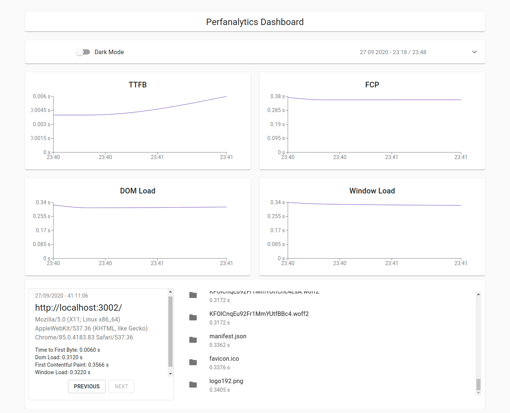

# Perfanalytics

Perfanalytics is an ecosystem which collects and criticizes web performance data.
It consists three subsystems:

* JS Library
* API
* Dashboard

Also, there is a simple one page react app to test the js library.

* You can test on Heroku at [https://perfanalytics-app.herokuapp.com/](https://perfanalytics-app.herokuapp.com/).
* To generate test data visit [https://perfanalytics-app.herokuapp.com/test](https://perfanalytics-app.herokuapp.com/test)
* Heroku can make you wait about 10-15 seconds at first.

### API

An express API that encapsulates all the ecosystem.
It uses mongoose library for mongodb management and has the following endpoints:

* GET /dashboard -> The dashboard app
* GET /test -> Test app for client-side library
* GET /metrics -> Returns all the metrics for last half hour
  * min (Date): Minimum value in the time range
  * max (Date): Maximum value in the time range
* POST /metrics -> Records metric data.
  * A valid metrics object required. Scheme: db/metric.js
  * Returns a message about result status of the process.
  * On success, returns the created object in the data field.
  * On failure, returns the error information in the error field.
  
> It is currently a little slow because of db. DBaaS is slower than I thought.
> It also needs a few improvements like redis cache.

### JS Library

Simple and tiny library that has no dependencies.
Bundles with rollup.js in umd format.

It relies on the following API's:

* [PerformanceObserver (observe)](https://developer.mozilla.org/en-US/docs/Web/API/PerformanceObserver)
* [Performance (timing)](https://developer.mozilla.org/en-US/docs/Web/API/Performance)
* [Navigator.sendBeacon()](https://developer.mozilla.org/en-US/docs/Web/API/Navigator/sendBeacon)

All of them has enough support to use.

#### Integration

Add the following snippet to head tag of your web app:

```html
<script src="https://perfanalytics-app.herokuapp.com/perfanalytics.js"></script>
<script>
  perfanalytics.init();
</script>
```

It will send the metrics asynchronous when you leave the app.

### Dashboard

Dashboard written with React.
Material UI, axios, recharts and a few tiny helper modules used.



## Development

1. Set up environment variables by creating a .env file in the root.
1. Install npm packages for all apps `yarn install:all`
1. Start the api `yarn start`
1. Start the dashboard `yarn start:dashboard`
1. Start the test app `yarn start:testapp`
1. Watch the js lib `yarn watch:jslib`

* To see the dashboard go to [http://localhost:3001](http://localhost:3001)
* To see the test app go to [http://localhost:3002](http://localhost:3002)

## Production

1. Setup a ready to use server with node or use docker `docker-compose up`
1. Set up environment variables.
1. Install npm packages for the api `yarn install`
1. Build react apps and js lib `yarn build`
1. Start the api `yarn start`

* To see the dashboard go to [https://yourserver.com/dashboard](https://yourserver.com/dashboard)
* To see the test app go to [https://yourserver.com/test](https://yourserver.com/test)

## Test

1. Set up environment variables. (OS Variables or .env)
1. Install npm packages for all apps `yarn install:all`
1. Build react apps and js lib `yarn build` (not required)
1. Start testing `yarn test`

## Environment variables

You need to set the env variables below to make the apps work nicely with each other.

* DB_URI = A convenient mongodb connection URI
* REACT_APP_CLIENT_SCRIPT_PATH = Should point to perfanalytics js library.
  * Development: http://localhost:3000/perfanalytics.js
  * Production example: https://yourserver.com/perfanalytics.js
* REACT_APP_SERVICE_URL = Root URL of the API
  * Development: http://localhost:3000
  * Production example: https://yourserver.com
